<div align="center">
  

  <h1>FitLife</h1>

  <p><strong>Mobile-first fitness &amp; lifestyle web application</strong></p>
  <p>Deterministic workout plans, guided sessions, progress analytics, nutrition discovery, and UAC attribution — built as a WebView-ready product.</p>

  <p>
    <strong>Live Demo:</strong> <a href="https://fitlife-web-app.vercel.app/">Demo Link</a><br />
    <a href="./docs/architecture/README.md">Architecture</a> ·
    <a href="./docs/prompts/README.md">AI-assisted workflow</a> ·
    <a href="./docs/screenshots/README.md">Screenshot gallery</a> ·
    <a href="https://fitlife-web-app.vercel.app/privacy">Privacy</a>
  </p>

  <p>React · TypeScript · Vite · Tailwind CSS · React Router · Zustand · TanStack Query · Framer Motion · Vitest</p>
</div>

<p align="center">
  <a href="https://fitlife-web-app.vercel.app/">
    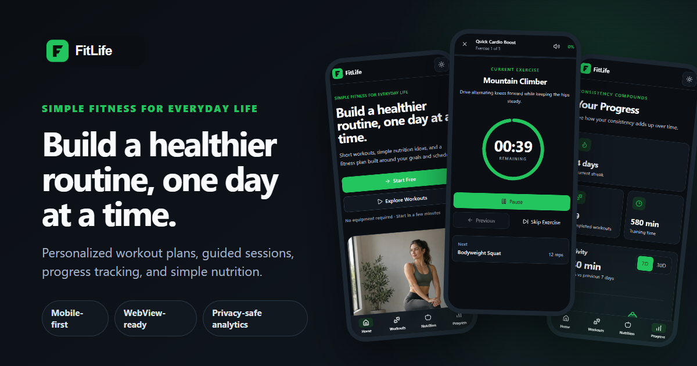
  </a>
</p>

## Overview

FitLife is a consumer-style fitness MVP created as an AI Product Builder test assignment. It demonstrates product thinking and frontend engineering across acquisition, onboarding, workout execution, local persistence, analytics, responsive design, and backend-ready boundaries—without claiming a real backend, medical personalization, or AI-generated plans.

## Promo Video


## Test Assignment Coverage

| Requirement                             | Status                    | Implementation                                                                              |
| --------------------------------------- | ------------------------- | ------------------------------------------------------------------------------------------- |
| AI-assisted site development            | ✅                        | Structured phase prompts and reviewed Codex workflow                                        |
| White/non-gambling product              | ✅                        | Fitness and nutrition product without betting mechanics                                     |
| WebView-ready web basis                 | ✅                        | Mobile-first layouts, safe areas, touch UX, SPA routing, and defensive storage              |
| UAC understanding                       | ✅                        | UTM capture, first/current touch, typed events, and documented install-attribution boundary |
| Functional product                      | ✅                        | Plans, workouts, guided sessions, progress, and nutrition                                   |
| Google Play/WebView criteria documented | ✅                        | [Readiness assessment](./docs/google-play-readiness.md)                                     |
| Privacy transparency                    | ✅                        | Public [Privacy Policy](https://fitlife-web-app.vercel.app/privacy)                         |
| Data Safety mapping                     | ✅                        | [Draft data mapping](./docs/google-play-data-safety.md)                                     |
| Native Android wrapper                  | Not part of current scope | Future production step; no Android project is included                                      |

## Product Experience

```text
Home → Onboarding → Personalized 7-Day Plan → Workout Details
     → Guided Session → Completion → Progress
```

- **Acquisition-ready Home:** quickly communicates the product value and leads into onboarding.
- **Personalized plan:** deterministic recommendations based on the selected goal and preferred duration.
- **Workout library:** responsive search and category/difficulty filtering with safe invalid routes.
- **Guided session:** timed and repetition exercises, rest, pause/resume, audio feedback, and recovery after navigation.
- **Progress:** persisted history drives totals, streaks, weekly comparisons, recent activity, and a custom SVG chart.

| Home                                                       | Onboarding                                                              | Personalized plan                                            |
| ---------------------------------------------------------- | ----------------------------------------------------------------------- | ------------------------------------------------------------ |
| 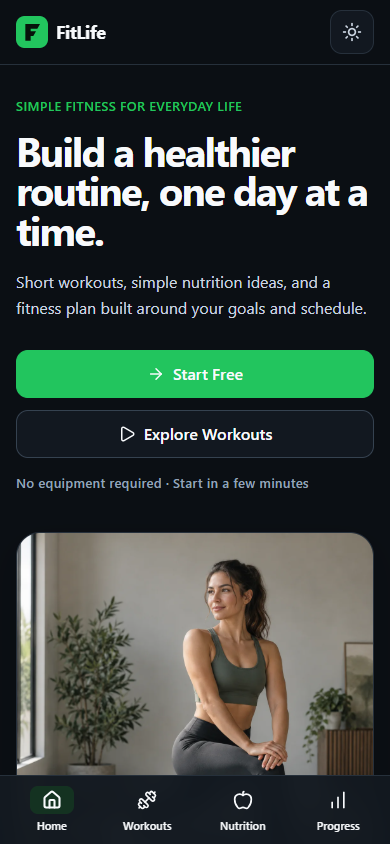 | 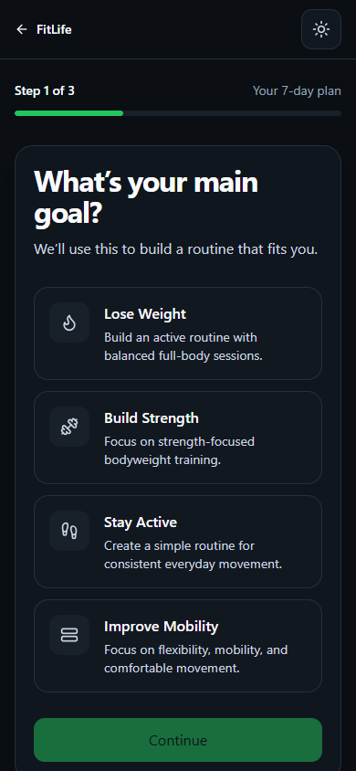 | 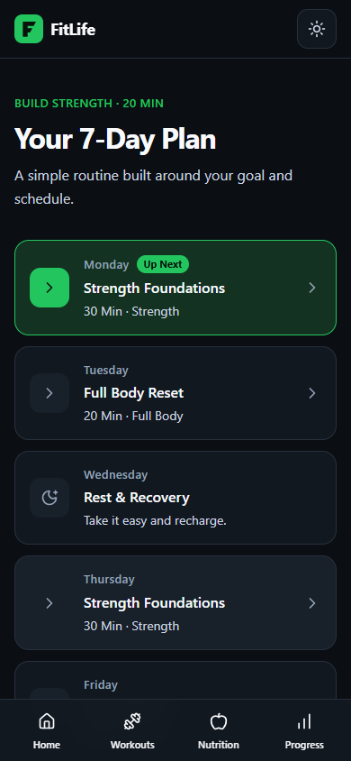 |

| Workout library                                                         | Guided workout session                                                         | Progress dashboard                                                             |
| ----------------------------------------------------------------------- | ------------------------------------------------------------------------------ | ------------------------------------------------------------------------------ |
| 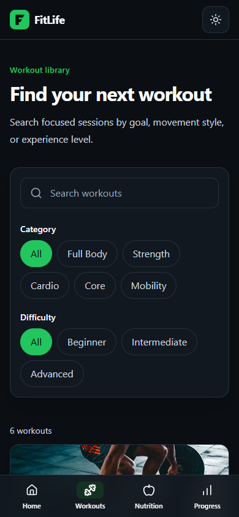 | 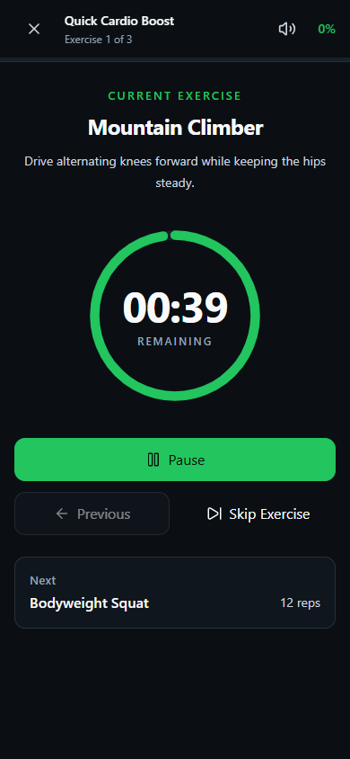 | 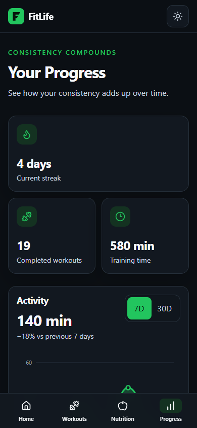 |

These are real 390 × 844 captures from the production preview. The [screenshot gallery](./docs/screenshots/README.md) records the route and state used for each image; no imagined application screens are included.

## Nutrition

The secondary lifestyle flow includes a searchable, filterable Nutrition Library and typed Recipe Details with ingredients, preparation steps, nutrition facts, and a custom macro visualization. Content is presented as practical meal inspiration, not medical advice.

| Nutrition library                                                         | Recipe details and macros                                                              |
| ------------------------------------------------------------------------- | -------------------------------------------------------------------------------------- |
| 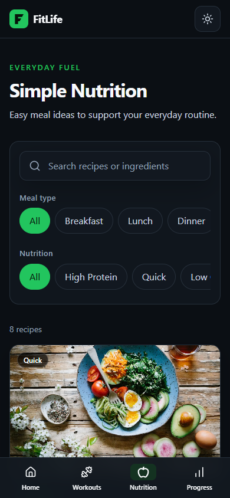 | 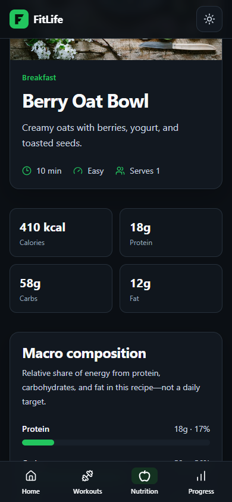 |

## UAC Attribution & Analytics

UTM attribution is captured before the initial page view and kept outside page components. The first valid attributed visit is preserved as `firstTouch`; later attributed visits update `currentTouch`. A persistent anonymous visitor ID and per-tab session ID are attached centrally alongside route and timestamp context.

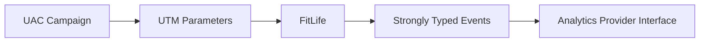

The provider abstraction keeps UI code independent of Google Analytics, Firebase, or another future vendor. The current implementation uses a development console provider and a production no-op provider.

Tracked product funnel:

```text
page_view → click_start → goal_selected → duration_selected
→ plan_created → workout_open → workout_started → workout_completed
```

### Analytics demo

Append the following query to a local or deployed Home URL:

```text
?utm_source=google&utm_medium=cpc&utm_campaign=fitness_test&utm_content=creative_01&debugAnalytics=true
```

The explicit `debugAnalytics=true` flag lazy-loads a review-only panel with recent events, anonymous/session identifiers, and first/current-touch attribution. It is absent from normal visits and does not expose secrets or environment values.

### UAC scope and limitation

The current implementation demonstrates **web acquisition attribution**:

```text
Campaign URL with UTM parameters → FitLife web entry
→ UTM capture → firstTouch/currentTouch → typed product events
```

An advertisement that sends a user through Google Play before first app open is a different flow. It would require future native install attribution through Google Play Install Referrer or a production attribution provider. Neither is implemented or claimed in this website repository.

<p align="center">
  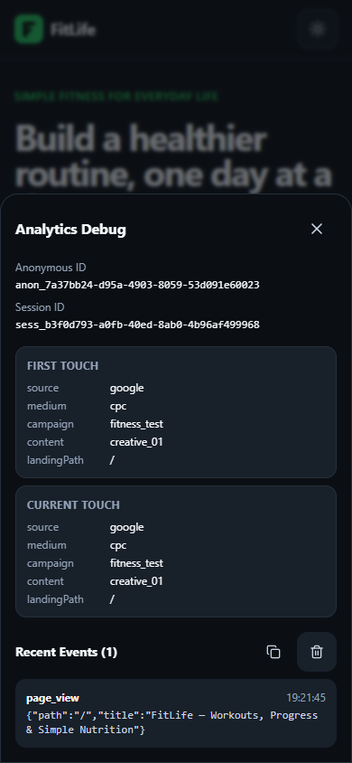
</p>

## Architecture

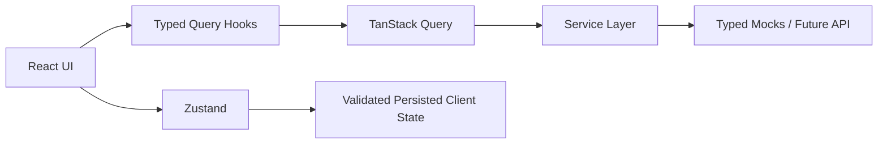

Server-like catalogs and entities belong to TanStack Query; local onboarding, plan, session, theme, audio, and completion state belong to Zustand. Pages do not import backend-shaped mock catalogs directly. See the concise [architecture notes](./docs/architecture/README.md).

## Technical Highlights

### Workout session

- Separate timed and repetition exercise behavior
- Deadline-based timer reconciliation rather than trusting interval frequency
- Pause/resume and explicit rest phases
- Route-leave pause safety and persisted recovery as paused
- Lightweight Web Audio feedback with lifecycle cleanup
- Deduplicated workout completion records

### Progress analytics

- Metrics derived from `CompletedWorkout[]`, without duplicate persisted totals
- Current streak and Monday-to-Sunday weekly calculations
- 7-day/30-day aggregation and previous-period comparisons
- Responsive, keyboard-accessible SVG Activity Chart
- No charting dependency

## Performance

Phase 10 introduced route-level `React.lazy()`, `Suspense`, a shared route fallback, and a separately lazy-loaded analytics debug panel. Below-the-fold catalog images remain lazy-loaded.

| Production entry JS |    Before |     After |
| ------------------- | --------: | --------: |
| Minified            | 534.64 kB | 392.93 kB |
| Gzip                | 160.61 kB | 125.88 kB |

These values come from the recorded Vite production builds. No Lighthouse score is claimed.

## Testing

Current verified result: **16 test files, 65/65 tests passing**.

Meaningful coverage includes plan generation, the workout session state machine, elapsed-time behavior, persistence validation, progress and streak calculations, chart geometry, recipe filtering/macros, attribution parsing/storage, identity, and analytics envelopes.

```bash
npm run test
npm run lint
npm run build
```

## AI-Assisted Development Process

FitLife followed a structured AI-assisted development workflow rather than an uncontrolled generation pass. Each implementation phase had explicit architecture, scope boundaries, acceptance criteria, and verification requirements. Codex assisted implementation; output was reviewed, tested, and stabilized before later phases.

The [phase prompt archive](./docs/prompts/README.md) preserves the exact core prompts available from the project conversation, including the pre-Phase-9 audit and Phase 8.5 stabilization work.

| Phase                                                 | Scope                                     |
| ----------------------------------------------------- | ----------------------------------------- |
| [1](./docs/prompts/phase-01-foundation.md)            | Foundation and typed service architecture |
| [2](./docs/prompts/phase-02-design-system.md)         | Design system and application shell       |
| [3](./docs/prompts/phase-03-home-theme.md)            | Theme system and Home experience          |
| [4](./docs/prompts/phase-04-onboarding-plan.md)       | Onboarding and deterministic plan         |
| [5](./docs/prompts/phase-05-workouts.md)              | Workout library and details               |
| [6](./docs/prompts/phase-06-workout-session.md)       | Guided workout session                    |
| [7](./docs/prompts/phase-07-progress-dashboard.md)    | Derived progress dashboard                |
| [8](./docs/prompts/phase-08-nutrition.md)             | Nutrition and recipe details              |
| [8.5](./docs/prompts/phase-08-5-stabilization.md)     | Audit and targeted stabilization          |
| [9](./docs/prompts/phase-09-uac-analytics.md)         | UAC attribution and analytics             |
| [10](./docs/prompts/phase-10-production-polish.md)    | Production polish                         |
| [10.5](./docs/prompts/phase-10-5-project-showcase.md) | Branding and project showcase             |

## Tech Stack

| Technology         | Responsibility                               |
| ------------------ | -------------------------------------------- |
| React + TypeScript | Strictly typed component application         |
| Vite               | Development and production builds            |
| Tailwind CSS       | Semantic tokens and responsive styling       |
| React Router       | SPA routing and route-level code splitting   |
| TanStack Query     | Asynchronous server-like state               |
| Zustand            | Persisted client and workout-session state   |
| Framer Motion      | Purposeful, reduced-motion-aware transitions |
| Lucide React       | Consistent application icons                 |
| Vitest             | High-value domain and persistence tests      |

## Google Play / WebView Readiness

FitLife is an owned, first-party mobile web product suitable as the web basis for a future Android WebView shell. This repository intentionally contains no Android wrapper, Kotlin code, APK/AAB, native bridge, app signing, or Play Console configuration.

The implemented web characteristics and the future native responsibilities are separated in the [Google Play / WebView Readiness document](./docs/google-play-readiness.md). Current data behavior is recorded in the [Google Play Data Safety draft](./docs/google-play-data-safety.md).

- Mobile-first layouts validated at 320, 360, 390, and 430 px
- Representative tablet/desktop validation at 768, 1024, and 1440 px
- Touch-friendly controls, mobile safe-area insets, and dynamic viewport units
- SPA navigation with Vercel fallback and direct-route support
- Defensive browser-storage access and persisted theme preference
- Initial UTM capture from the WebView entry URL
- Dark theme by default, manual light-theme toggle, and both themes QA-tested

| Default dark theme                                                     | Persisted light theme                                                           |
| ---------------------------------------------------------------------- | ------------------------------------------------------------------------------- |
|  | 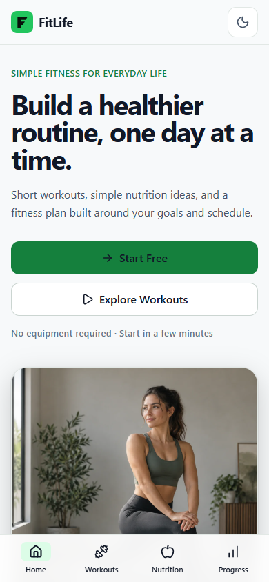 |

> FitLife is WebView-ready web architecture; it does not include or claim a native bridge or released mobile application.

The public web policy is available at [fitlife-web-app.vercel.app/privacy](https://fitlife-web-app.vercel.app/privacy).

## Project Structure

```text
src/
├── api/          # Generic typed API client foundation
├── components/   # Shared layout, UI, navigation, and domain components
├── hooks/        # Query, analytics, progress, and session hooks
├── lib/          # Analytics, attribution, plan, chart, and session logic
├── mocks/        # Typed mock resources
├── pages/        # Route-level feature modules
├── services/     # Backend-ready domain boundaries
├── store/        # Serializable client/session state
└── types/        # Shared domain models

docs/
├── architecture/ # Concise engineering notes
├── assets/       # Brand and preview guidance
├── prompts/      # Exact structured phase prompts
├── screenshots/  # Real product screenshots and capture manifest
├── google-play-readiness.md
└── google-play-data-safety.md
```

## Running Locally

```bash
npm install
npm run dev
```

Production preview:

```bash
npm run build
npm run preview
```

### Environment variables

Copy `.env.example` when configuring an API endpoint. `VITE_API_URL` is the only supported value. Every `VITE_*` variable is bundled into public client code and must never contain credentials or secrets.

## Future Improvements

- Replace typed mocks with a real backend and authenticated cloud sync
- Connect a production analytics provider behind the existing interface
- Move media to a production image pipeline/CDN
- Add a native wrapper and bridge only when a mobile distribution target exists
