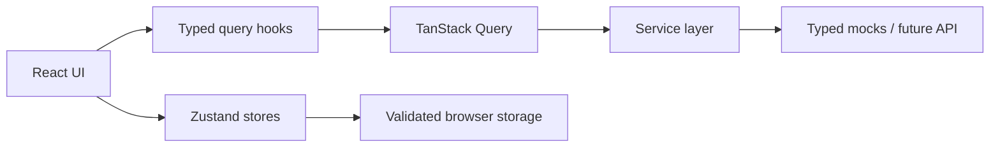

# FitLife architecture

FitLife separates backend-shaped resources from local application state so the mock-first MVP can evolve without rewriting its pages.

## Server-like data

Workout and recipe catalogs, individual entities, current user data, and backend-shaped progress metadata flow through centralized TanStack Query keys and domain services. Components never import those mock catalogs directly.

## Client and session state

Zustand owns onboarding preferences, the generated plan, the active workout session, audio preference, theme, and completed workout history. Persisted envelopes are validated and versioned where required; an active session restores as paused rather than silently advancing.

## Workout session

The session state machine supports timed and repetition exercises, rest phases, deadline-based elapsed-time reconciliation, pause/resume, route-leave safety, persisted recovery, audio feedback, and deduplicated completion records.

## Progress

Totals, streaks, weekly activity, comparisons, recent sessions, and 7D/30D chart points are derived from `CompletedWorkout[]`. The responsive SVG Activity Chart uses project geometry utilities rather than a chart dependency.

## Acquisition and analytics

UTM capture runs before the first page view. A persistent anonymous ID, per-tab session ID, route context, first touch, and current touch are attached centrally to strongly typed events before they reach the provider interface.
